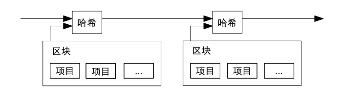
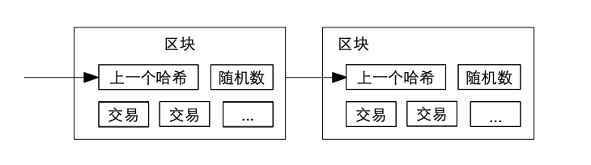

## Bitcoin: A Peer-to-Peer Electronic Cash System
- 电⼦现⾦系统
  
  允许在线⽀付直接从⼀⽅发送到另⼀⽅，⽽⽆需通过⾦融机构，但需要被信任的第三⽅来防⽌[双重支付](https://zh.wikipedia.org/wiki/%E9%9B%99%E9%87%8D%E6%94%AF%E4%BB%98)。
- 比特币
  
  使⽤点对点⽹络去解决双重⽀出问题。它为每笔交易标记时间戳。
  
  > 把交易的散列数据录⼊⼀个不断延展的、以散列为基础的⼯作证明链上，形成⼀个如⾮完全重做就不可能改变的记录，最⻓链。
  
  > ⼀⽅⾯⽤来证明已被⻅证的事件及其顺序，与此同时，也⽤来证明它来⾃于最⼤的 CPU 算⼒池。只要绝⼤多数 CPU 算⼒被良性节点控制。那么，良性节点将会⽣成最⻓链，并且在速度上超过攻击者。
  
  > 这个⽹络本身需要最⼩化的结构。信息将以最⼤努⼒为基本去传播，节点来去⾃由；但，加⼊之时总是需要接受最⻓的⼯作证明链作为它们未参与期间所发⽣之⼀切的证明。

### 基于加密证明的电子支付系统 

互联网商业几乎完全依赖金融机构作为可信任第三方处理电子支付，由于金融机构不可避免的需要仲裁纠纷，所以会出现下述问题：

> 交易可被撤销 ===> 增加交易成本 ===> 限制最小实际交易额度 ===> 杜绝小额交易的可能性 ===> 增加信任需求

基于密码学原理的电子支付系统，允许任何有交易意愿的双方能直接交易而不需要一个可信任第三方。使用点对点分布式时间戳服务器为基于时间的交易序列生成计算上的证据来解决双重支付问题。只要**诚实节点集体控制的 CPU 算力大于每一个合作攻击节点群的 CPU 算力**，那么这个系统就是安全的。

### 交易

- 记录上一笔交易的hash以及新的拥有者的公钥，形成一个数字签名链。
- 让所有参与者接收到一个唯一的交易历史，从而避免依赖“铸币厂”这样的中心存在。

### 时间戳服务器

时间戳服务器计算包含多个需要被打时间戳的数据
项的区块的哈希值并广泛地发布这个哈希值。每个时间戳的哈希值都纳入了上一个时间戳，形成一条链，后面的时间戳进一步增强前一个时间戳。

### 工作量证明

工作量证明采取搜索一个数，使得被哈希时，如使用 SHA-256，得到的哈希值以数个`0`开始。平均所需工作量将随所需`0`呈指数级增长而验证却只需执行一次哈希。
> 难以寻找，易于验证

工作方式：在区块中加入一个随机数，直到使得区块的哈希值满足所需`0`的数被找到。

一旦消耗了 CPU 算力使区块满足了工作量证明，除非重做这个工作否则就无法更改区块。由于后面的区块是链接在这个区块后面的，改变这个区块将需要重做所有后面的区块。

> 最长的链代表了最大的算力

基于平均每小时产生的区块数量的一个移动平均值，来应对硬件算力综合的不断增加，以及随着时间推进可能产生的节点参与数量变化， 如果区块生成得过快，那么难度将会增加。