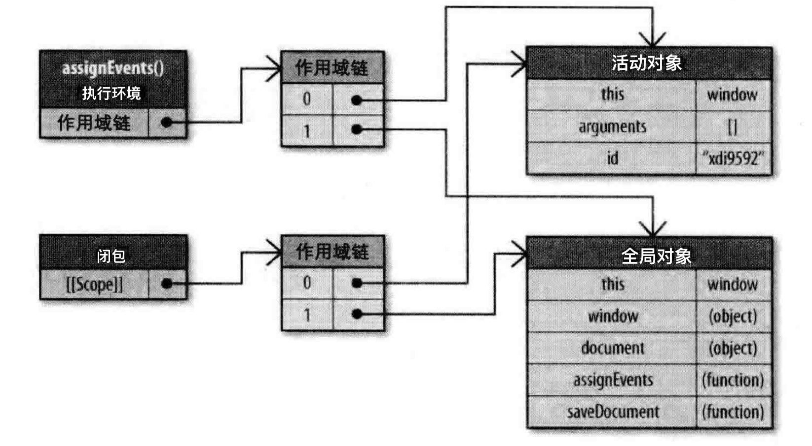
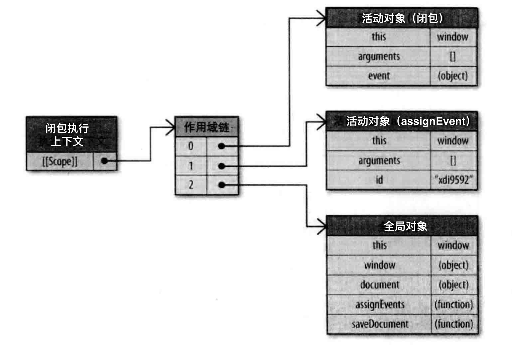
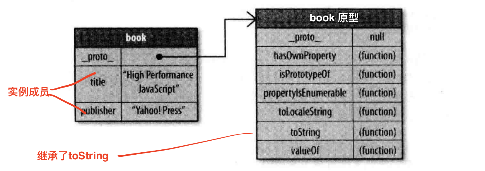

## 数据存取 Data Access

计算机科学中有一个经典问题是通过改变数据的存储位置来获得最佳的读写性能，数据存储的位置关系到代码执行过程中数据的检索速度。在`JavaScript`中，这个问题相对简单，因为只有几种存储方案可供选择。不过，和其他编程语言一样，数据的存储位置很大程度上影响其读取速度。`JavaScript`中有下面四种基本的数据存取位置。

- #### 字面量
	字面量只代表其自身，不存储在特定的位置。```JavaScript```中的字面量有：字符串、数字、布尔值、对象、数组、函数、正则表达式，以及特殊的```null```和```undefind```值。
- #### 本地变量
	开发人员使用```var```定义的数据存储单元。
- #### 数组元素
	存储在```JavaScript```数组对象内部，以数字为索引。
- #### 对象成员
	存储在```JavaScript```对象内部，以字符串为索引。

从一个字面量和一个局部变量中存取数据的性能差异是微不足道的。访问数组元素和对象成员的代价则会高一些。

### 管理作用域 Managing Scope

#### 作用域链和标识符解析 Scope Chains and Identifier Resolution

每一个```JavaScript```函数都表示为一个对象，是```Function```对象的一个实例。```Function```对象同其他对象一样，拥有可以编程访问的属性，和一系列不能通过代码访问而仅通过```JavaScript```引擎存取的内部属性，其中一个属性为```[[scope]]```，它包含了一个函数被创建的作用域中对象的集合，集合被称为作用域链。它决定哪些数据能够被函数访问，作用域中的每一个对象被称为一个可变对象，以键值对的形式存在，当一个函数创建后，它的作用域链会被创建此函数的作用域中可访问的数据对象所填充。

如```add```函数被创建时：
```js
	function add(num1, num2) {
		var sum = num1 + num2
		return sum
	}
```


函数```add```的作用域将会在执行时用到，当执行
```js
	var total = add(5, 10)
```
会创建一个称为执行环境```(execution context)```的内部对象。多次调用同一个函数会导致创建多个执行环境，当函数执行完毕，执行环境就会被销毁。

每个执行环境都有自己的作用域链，用于解析标识符，当执行环境被创建，它的作用域链初始化为当前函数的```[[scope]]```属性中的对象。这些值按照它们出现的顺序被复制到执行环境的作用域中。该过程一旦完成，一个被称为活动对象 ```activation object```的新对象就为执行环境创建好了。该对象包含了所有局部变量，命名空间，参数集合以及```this```。然后此对象被推入作用域链的最顶端。


函数执行过程中，每遇到一个变量，都会经历一次标识符解析的过程以决定从哪里获取或存储数据。从作用域头（活动对象）开始搜索，如果没找到就继续搜索作用域链中的下一个对象。若无匹配标识符将被视为未定义，每次搜索访问```sum```、```num1```、```num2```时都会产生搜索过程，从而影响了性能。

如果两个相同名字的变量存在于作用域链的不同部分，那么标识符就是遍历作用域链时最先找到的那个，也就是第一个变量遮蔽```(Shadow)```了第二个。

#### 标识符解析的性能 Identifier Resolution Performance

在执行环境的作用域链中，一个标识符所在位置越深，它的读写速度越慢。因此读取局部变量是最快的，全局变量是最慢的，全局变量总是存在于执行环境作用域链的最末端。

如果某个跨作用域的值在函数中被引用了一次以上，那么就把它存到局部变量里面：
```js
	function initUI() {
		// var bd = document.body,
		// 	links = document.getElementsByTagName('a'),
		// 	i = 0,
		// 	len = links.length;

		// 该函数引用了三次document，而它是一个全局对象
		var doc = document,
			bd = doc.body,
			links = doc.getElementsByTagName('a'),
			i = 0,
			len = links.length;
		
		while(i < len) {
			update(links[i++])
		}
		doc.getElementById('go-btn').onclick = function() {
			start();
		}
		bd.className = 'active'
	}
```

#### 闭包、作用域和内存 Closures, Scope, and Memory

```js
	function assignEvents() {
		var id = "xdi9592"
		document.getElementById('btn').onlick = function(event) {
			saveDocument(id)
		}
	}
```
```assignEvents()```函数给一个```DOM```元素设置事件处理函数，这个函数就是闭包。它在```assignEvent()```执行时创建，为了能访问```id```变量，必须创建一个特殊的作用域。如下的活动对象为闭包所创建：

由于闭包的```[[scope]]```属性包含了与执行环境作用域链相同的对象引用，因此会产生副作用，函数的活动对象会随着执行环境一起销毁，由于引用存在于闭包的```[[scope]]```中，因此激活对象无法销毁。

当闭包代码执行时，会创建一个执行环境，它的作用域与属性```[[scope]]```中所引用的两个相同的作用域链对象一起被初始化，然后活动对象为闭包自身所创建。


闭包中的两个标识符，```id```和```saveDocument```，它们在作用域链第一个对象之后，这就是使用闭包最需要关注的性能点，在频繁访问跨作用域标识符时，每次访问都会带来性能损失。可以配合跨作用域处理意见，来减轻闭包的影响。

### 对象成员 Object Members

#### 原型 Prototypes

对象通过一个内部的```__proto__```属性绑定到它的原型。一旦创建一个内置对象的实例，它们就会自动拥有一个Object实例作为原型。因此对象可以有两种成员类型：实例成员（own成员）和原型成员。实例成员直接存在于对象实例中，原型成员则从对象成员继承而来。通过```hasOwnProperty()```来判断对象是否包含特定的属性。

```js
	var book = {
		title: "High Performance JavaScript",
		publisher: "Yahoo! Press"
	}
	book.toString()	// "[object Object]"
```


### 小结 Summary
在JavaScript中，数据存储的位置会对代码整体性能产生重大的影响。数据存储共有4种方式：直接量、变量、数组项、对象成员。它们有不同的性能考虑。
- 访问直接量和局部变量的速度最快，相反，访问数组元素和对象成员相对较慢。
- 由于局部变量存在于作用域链的起始位置，因此访问局部变量比访问跨作用域变量更快。变量在作用域链中的位置越深，访问所需时间就越长。由于全局变量总处在作用域链的最末端，因此访问速度也是最慢的。
- 避免使用with语句，因为它会改变运行期上下文作用域链。同样，try-catch语句中的catch子句也有同样的影响，因此也要小心使用。
- 嵌套的对象成员会明显影响性能，尽量少用。
- 属性或方法在原型链中的位置越深，访问它的速度也越慢。
- 通常来说，你可以通过把常用的对象成员、数组元素、跨域变量保存在局部变量中来改善JavaScript性能，因为局部变量访问速度更快。
