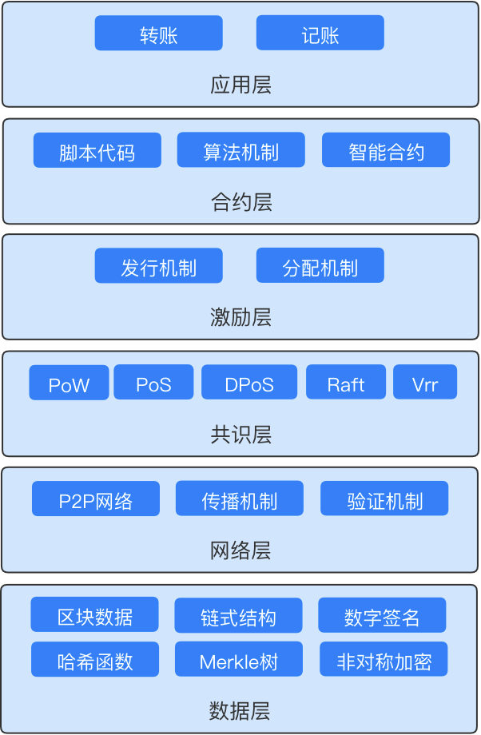
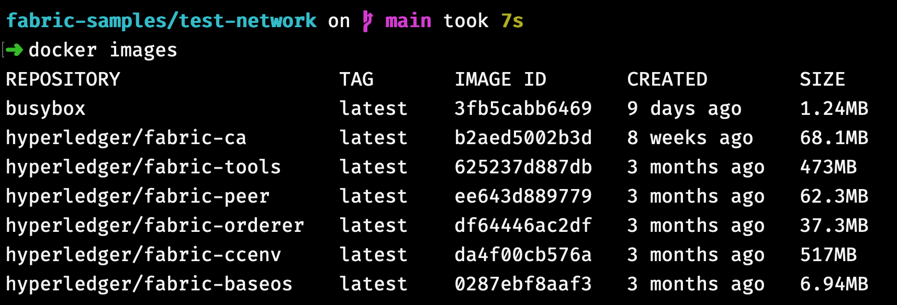

# Hyperledger Fabric

## 序言

Hyperledger Fabric 有很多共识机制、智能合约、分布式账本和密码学的知识，它利用 Docker 和 Kubernetes 等云原生开发软件来实现，进行开发前需要具备这些前置基础。


<!--  -->

## macOS 环境搭建
> 请确保当前网络环境可以翻墙

### Homebrew
> macOS 中推荐使用 [Homebrew](https://brew.sh) 进行安装

- 执行安装命令 
```bash
$ /bin/bash -c "$(curl -fsSL https://raw.githubusercontent.com/Homebrew/install/master/install.sh)"
```

- 检查安装结果

```bash
$ brew --version

> Homebrew 3.2.5
```

### Git
> 使用 brew 安装 [Git](https://git-scm.com/downloads)

- 执行安装命令 

```bash
$ brew install git
```

- 检查安装结果
```bash
$ git --version

> git version 2.15.0
```

### cURL
> 使用 brew 安装 [cURL](https://github.com/curl/curl)

- 执行安装命令 
```bash
$ brew install curl
```

- 检查安装结果
```bash
$ curl --version

> curl 7.64.1 (x86_64-apple-darwin20.0) libcurl/7.64.1 (SecureTransport) LibreSSL/2.8.3 zlib/1.2.11 nghttp2/1.41.0
Release-Date: 2019-03-27
```

### Docker 

> 使用 brew 安装 [Docker](https://docs.docker.com/get-docker/)

- 执行安装命令 Homebrew v3.x

```bash
$ brew install --cask --appdir="/Applications" docker
```

- 启动 Docker

```bash 
$ open /Applications/Docker.app
```

- 检查安装结果

```
$ docker --version

> Docker version 20.10.8, build 3967b7d
```

```
$ docker-compose --version

> docker-compose version 1.29.2, build 5becea4c
```

### Go
> 可选：需要编写 [Chaincode](https://hyperledger-fabric.readthedocs.io/en/release-2.2/chaincode4ade.html) 与 SDK 时，进行安装

- 执行安装命令 
``` bash
$ brew install go@1.18.2
```

- 检查安装结果
```
$ go version

> go1.18.2 darwin/amd64
```

### JQ
> 可选： Channel configuration transactions时需要

- 执行安装命令 
```bash
$ brew install jq
```

- 检查安装结果
```
$ jq --version

> jq-1.6
```

## 安装 Fabric 与 Fabric 示例

- 创建工作区目录
> Go Developers 使用该`$HOME/go/src/github.com/<your_github_userid>`目录
>
> 这是 Go 语言社区对 Go 项目的推荐
```bash
mkdir -p $HOME/go/src/github.com/<your_github_userid>

cd $HOME/go/src/github.com/<your_github_userid>
```

- 执行 `bootstrap.sh`
```bash
curl -sSL https://raw.githubusercontent.com/hyperledger/fabric/main/scripts/bootstrap.sh| bash -s
```
> 会自动下载所需依赖镜像

